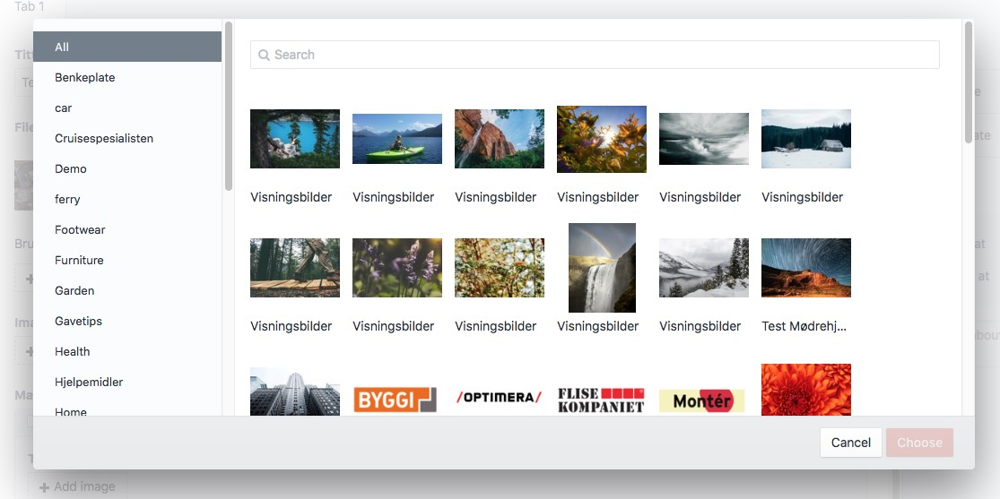
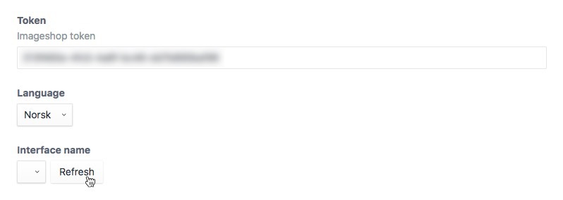
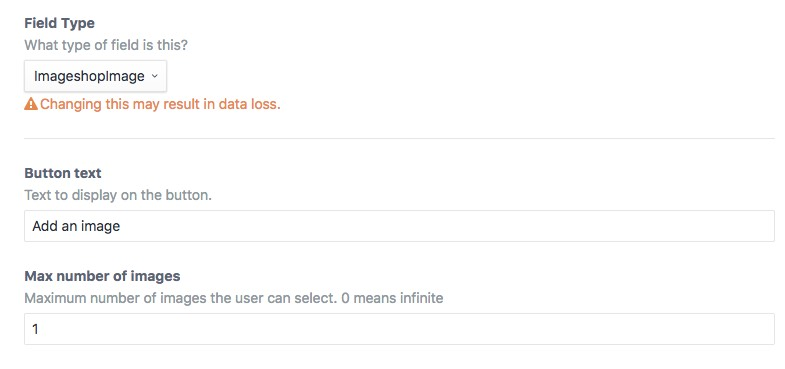

# Imageshop plugin for Craft CMS 3.x

Integrate with an Imageshop account and use Imageshop resources in Craft


## Requirements

This plugin requires Craft CMS 3.0.0-beta.23 or later.

## Installation

To install the plugin, follow these instructions.

1. Open your terminal and go to your Craft project:

        cd /path/to/project

2. Then tell Composer to load the plugin:

        composer require vangenplotz/imageshop

3. In the Control Panel, go to Settings → Plugins and click the “Install” button for Imageshop.

## Imageshop Overview



The field has been made to mimic the normal Craft asset field. To the right the user can choose to filter the results
by the available categories.

There is a search field that lets the user search amongst the images. The results are loaded dynamically as the user scrolls
the list.


The user can rearrange the order of the images by dragging and dropping.

## Configuring Imageshop

### Plugin settings

Once installed you need to go to the plugin settings and provide a Imageshop token.



Chose one of the available languages.

Press the "Refresh" button under "Interface name" to get available interfaces for the provided token.

Save the changes once you're finished.

Note that changing these values after users have added images to fields of this field type will make the images become
unavailable.

### Field settings



You can add the field type to a standalone field or to a matrix block.

Choose the text on the "Add image"-button and the "Maxiumum number of images" the user can choose. A value of `0` means the
user kan choose an infinite amount of images.

## Using Imageshop

The plugin does not store anything but the `DocumentId`-reference to the Imageshop image document. Therefore we need to handle
the display of images somewhat differently.

### Get an array with all images
```twig



  
  

```

## Imageshop Roadmap

Some things to do, and ideas for potential features:

* Release it

Brought to you by [Vangen & Plotz AS](https://vangenplotz.no/)
